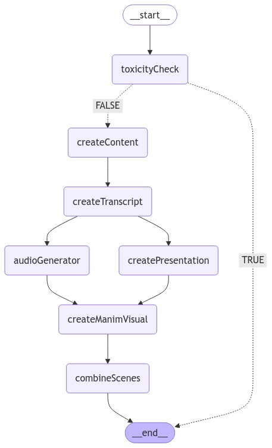

# Learn Anything

## Project Structure

- **src/main.ts**: The main entry point for the application, orchestrating the workflow using a state graph.
- **src/edges/**: Contains logic for conditional transitions between nodes, such as the `isToxic` function.
- **src/models/**: Defines the LLM model.
- **src/nodes/**: Houses different types of nodes, each with specific functionalities like `toxicityCheck`, `createContent`, etc.
- **src/state/**: Manages the application's state. This can be used across the nodes and edges to store and retrieve data.



## Installation

To install the necessary dependencies, run:

```bash
cd learn-anything
yarn install
```

## Usage

1. Create a `.env` file with the following content:

   ```
   OPENAI_API_KEY=your_openai_api_key_here
   ```

2. Start the application using:

   ```bash
   yarn run-agent
   ```

## Dependencies

The project relies on several key libraries:

- `@langchain/community`
- `@langchain/core`
- `@langchain/langgraph`
- `@langchain/openai`
- `@langchain/pinecone`
- `dotenv`
- `ts-node`

## Development

For development, the following tools are used:

- `ebx`: Used to execute the main script with specific configurations.
- `tsx`
- `typescript`
