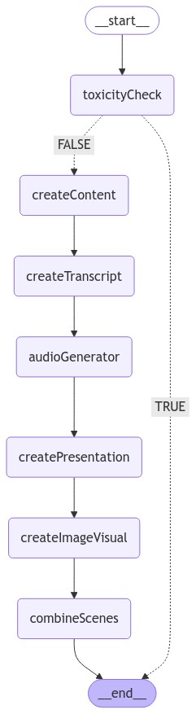

# Learn Anything (with Next.js)

## Project Structure

- **src/server/main.ts**: The main entry point for the application, orchestrating the workflow using a state graph.
- **src/server/edges/**: Contains logic for conditional transitions between nodes, such as the `isToxic` function.
- **src/server/models/**: Defines the LLM (Large Language Model) used in the application.
- **src/server/nodes/**: Houses different types of nodes, each with specific functionalities like `toxicityCheck`, `createContent`, etc.
- **src/serever/state/**: Manages the application's state. This can be used across the nodes and edges to store and retrieve data.

In the Next.js part of the application:

- **pages/index.tsx**: The main page that you can start editing. The page auto-updates as you edit the file.
- **pages/api/**: API routes for backend functionality. You can access them on [http://localhost:3000/api/hello](http://localhost:3000/api/hello) and edit in `pages/api/hello.ts`. Files in this directory are treated as [API routes](https://nextjs.org/docs/api-routes/introduction) instead of React pages.
- **next/font**: Used to automatically optimize and load Inter, a custom Google Font.



## Getting Started

### Installation

To install the necessary dependencies for the entire project:

```bash
cd learn-anything
yarn install
```

### Usage

1. Create a `.env` file in the root directory with the following content:

   ```bash
   OPENAI_API_KEY=your_openai_api_key_here
   ```

2. Start the AI-based backend:

   ```bash
   yarn run-agent
   ```

3. Start the Next.js development server for the frontend:

   ```bash
   npm run dev
   # or
   yarn dev
   # or
   pnpm dev
   # or
   bun dev
   ```

Open [http://localhost:3000](http://localhost:3000) in your browser to see the frontend. 

You can interact with the AI backend by defining more API routes in the `pages/api` folder, or extend the AI functionality in `src/main.ts`.

## Dependencies

The backend AI-based application relies on several key libraries:

- `@langchain/community`
- `@langchain/core`
- `@langchain/langgraph`
- `@langchain/openai`
- `@langchain/pinecone`
- `dotenv`
- `ts-node`

The frontend uses Next.js and related tooling.

## Development

For backend development, the following tools are used:

- `ebx`: Used to execute the main script with specific configurations.
- `tsx`
- `typescript`

For frontend development, simply follow the standard Next.js development cycle as described in the [Next.js documentation](https://nextjs.org/docs).

## Learn More

To learn more about the AI-related backend, check out the LangChain documentation and explore more about handling state graphs, transitions, and LLM models. 

To learn more about Next.js, take a look at the following resources:

- [Next.js Documentation](https://nextjs.org/docs) - learn about Next.js features and API.
- [Learn Next.js](https://nextjs.org/learn) - an interactive Next.js tutorial.

You can also check out [the Next.js GitHub repository](https://github.com/vercel/next.js/) and contribute to the project.

## Deploy on Vercel

The easiest way to deploy your Next.js app is to use the [Vercel Platform](https://vercel.com/new?utm_medium=default-template&filter=next.js&utm_source=create-next-app&utm_campaign=create-next-app-readme) from the creators of Next.js.

Check out [Next.js deployment documentation](https://nextjs.org/docs/deployment) for more details.